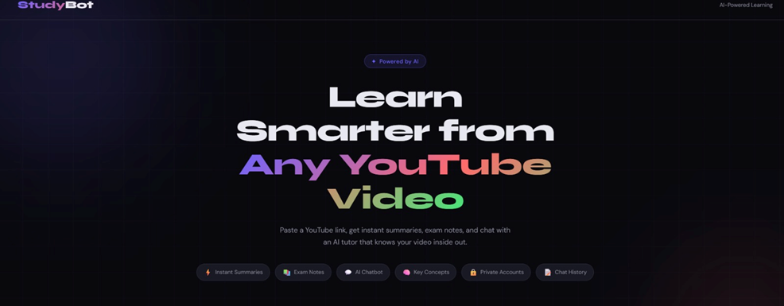
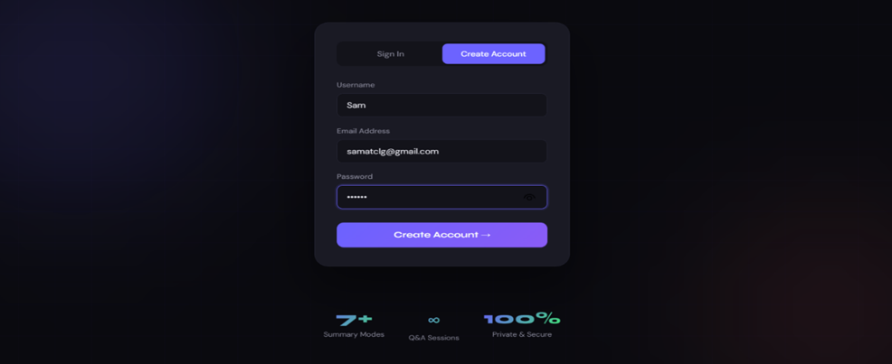
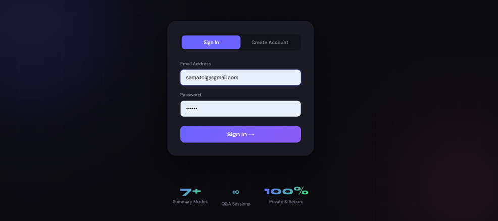
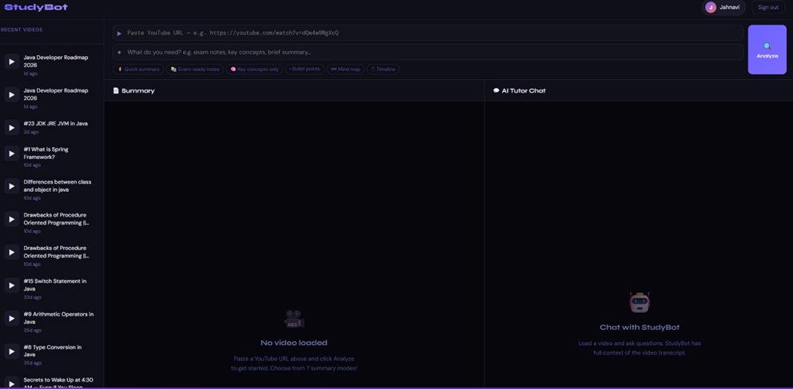
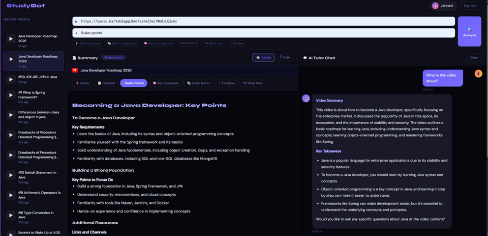
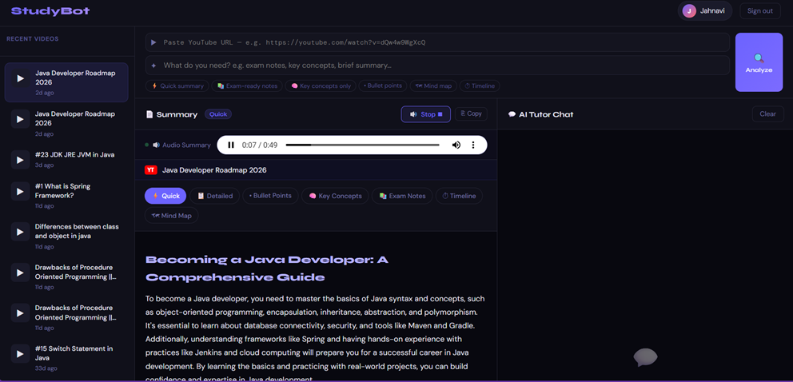
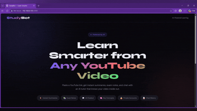

# 🎓 StudyBot — Interactive Chatbot with Video Summarization for Students

> An AI-powered web app that summarizes YouTube videos and lets students have a full conversation with a chatbot that knows the video inside out.

<br/>

<div align="center">

## 📸 Screenshots

<table>
  <tr>
    <td></td>
    <td></td>
    <td></td>
  </tr>
  <tr>
    <td align="center"><b>🏠 Home</b></td>
    <td align="center"><b>🔐 Registration</b></td>
    <td align="center"><b>🔐 Login</b></td>
  </tr>
  <tr>
    <td></td>
    <td></td>
    <td></td>
  </tr>
  <tr>
    <td align="center"><b>🏠 Dashboard</b></td>
    <td align="center"><b>🎥 Summary and 💬 AI Chatbot</b></td>
    <td align="center"><b>🔊 Audio Summary</b></td>
  </tr>
</table>

</div>

<br/>

---

## 🎬 Demo

<div align="center">

 
> 💡 **Can't see the GIF?** [▶ Download & watch demo video](assets/demo.mp4)
 
</div>

---

## ✨ Features

| Feature | Description |
|---|---|
| 🔐 User Accounts | Register/login with email & password — fully private per-user data |
| 🎥 YouTube Summarizer | Paste any YouTube URL with captions to get an instant summary |
| 7 Summary Modes | Quick, Detailed, Bullet Points, Key Concepts, Exam Notes, Timeline, Mind Map |
| 💬 AI Chatbot | Chat with Groq AI about the video — full transcript context |
| 🧠 Chat Memory | All Q&A history is saved per video per user |
| 📚 History Sidebar | Quickly switch between all your past videos |
| 🔊 Audio Summary | User can listen to the summary |
| 📋 Copy to Clipboard | Export any summary with one click |
| 🌙 Dark Mode UI | Clean, modern, student-friendly dark theme |

---

## 🚀 Quick Start

### 1. Clone / Download the project folder

```
studybot/
├── app.py              ← Flask backend (main server)
├── run.py              ← Easy launcher script
├── requirements.txt    ← Python dependencies
├── assets/             ← Screenshots & demo video/GIF
│   ├── demo.gif
│   ├── demo.mp4
│   └── screenshots/
├── database/           ← Auto-created SQLite DB
└── templates/
    ├── index.html      ← Login / Register page
    └── dashboard.html  ← Main app UI
```

### 2. Install ffmpeg (required for audio processing)

| OS | Command |
|---|---|
| Mac | `brew install ffmpeg` |
| Linux | `sudo apt install ffmpeg` |
| Windows | Download from [ffmpeg.org](https://ffmpeg.org/download.html) and add to PATH |

### 3. Install Python dependencies

```bash
pip install flask yt-dlp openai-whisper anthropic
```

> **Note:** `openai-whisper` will download the Whisper model (~75 MB for `base`) on first transcription run. This is cached locally for future use.

### 4. Get your Anthropic API key

1. Go to [https://console.anthropic.com](https://console.anthropic.com)
2. Create an account and go to **API Keys**
3. Create a new key and copy it

### 5. Set your API key

**Mac/Linux:**
```bash
export GROQ_API_KEY="sk-ant-your-key-here"
```

**Windows CMD:**
```cmd
set GROQ_API_KEY=sk-ant-your-key-here
```

**Windows PowerShell:**
```powershell
$env:GROQ_API_KEY="sk-ant-your-key-here"
```

### 6. Run the app

```bash
python run.py
```

Then open your browser at: **http://localhost:5000**

---

## 🎯 How to Use

1. **Create an account** — your data is private and saved to your profile
2. **Paste a YouTube URL** — any video with auto-generated or manual captions
3. **Choose a summary mode** — pick what kind of notes you need
4. **Chat with the AI tutor** — ask questions, get explanations, quiz yourself
5. **Switch between videos** — all your history is saved in the sidebar

---

## 📋 Summary Modes Explained

| Mode | Best For |
|---|---|
| ⚡ Quick | Fast 5-sentence overview |
| 📋 Detailed | Comprehensive notes covering everything |
| • Bullet Points | Skimmable key points |
| 🧠 Key Concepts | Definitions and explanations of main ideas |
| 📚 Exam Notes | Definitions + potential questions + quick revision |
| ⏱ Timeline | Chronological outline of the content |
| 🗺 Mind Map | Visual text-based topic map |

---

## 🛠 Tech Stack

| Layer | Technology |
|---|---|
| Backend | Python 3.12 + Flask |
| Database | SQLite (via Python `sqlite3`) |
| AI | GROQ (llama-3.1-8b-instant) |
| Transcripts | `yt-dlp` (download audio) + `openai-whisper` (transcribe locally) |
| Frontend | HTML5 + CSS3 + Vanilla JavaScript |
| Markdown | `marked.js` (CDN) |
| Fonts | Google Fonts (Syne + DM Sans) |

---

## 📁 Project Architecture

```
User Request
     ↓
Flask Router (app.py)
     ↓
Auth Check (session-based)
     ↓
YouTube Transcript API → transcript text
     ↓
GROQ API → summary / chat response
     ↓
SQLite DB (store summaries, chat history)
     ↓
JSON Response → Browser renders with JS
```

---

## ⚠️ Notes

- **YouTube videos must have captions** (auto-generated or manual). Videos without captions cannot be transcribed.
- The app uses **session-based authentication** — sessions persist for 7 days.
- All data is stored locally in `database/studybot.db` — no external database needed.
- Chat history is stored per video per user — switch videos anytime without losing context.

---

## 🔧 Troubleshooting

**"Could not fetch transcript" / yt-dlp error**
→ Make sure `ffmpeg` is installed and on your PATH. Run `ffmpeg -version` to verify.

**Transcription is slow**
→ Whisper `base` model takes ~1 min per 10 min of video on CPU. Set `WHISPER_MODEL=tiny` for faster (less accurate) results, or `WHISPER_MODEL=small` / `medium` for better accuracy.

```bash
export WHISPER_MODEL=tiny   # fastest
export WHISPER_MODEL=small  # good balance
```

**"GROQ_API_KEY not set"**
→ Set your API key as shown in step 5 above.

**Port already in use**
→ Run with: `PORT=5001 python run.py`

---

## 🎓 For Students

This app was built as a student project demonstrating:
- Full-stack Python web development (Flask)
- RESTful API design
- SQLite database with user auth
- Integration with LLM APIs (Groq)
- YouTube transcript processing
- Modern responsive UI design

---

*Built with ❤️ for students, by students.*
